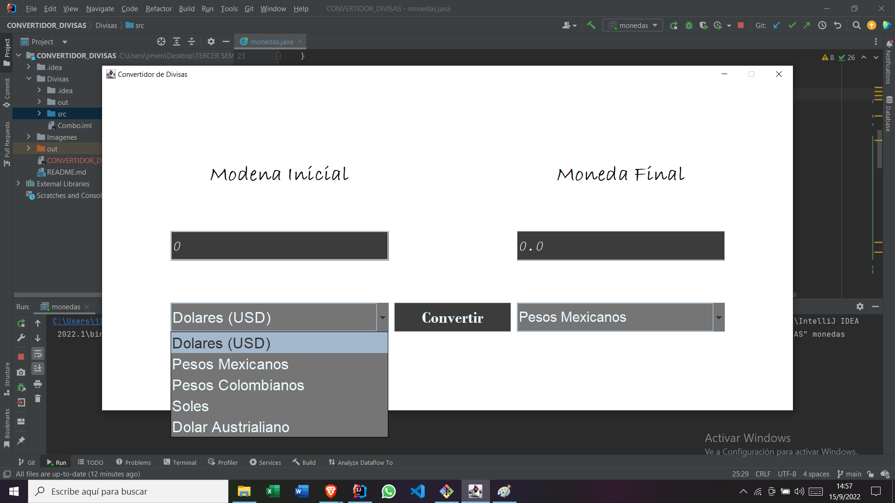
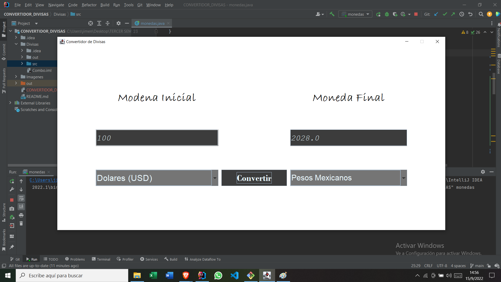

# Convertidor de Divisas

<h5>El Funcionamiento del Convertidor de Divisas es sencillo, se mostrara dos menus para que el usuario pueda seleccionar la divisa que va a ingresar y la que desea realizar el cambio.</h5>

<h6>Una vez seleccionado la divisa inicial y final, solo se debe colocar la cantidad y dat click en "Convertir" para mostrar el resultado.  </h6>

